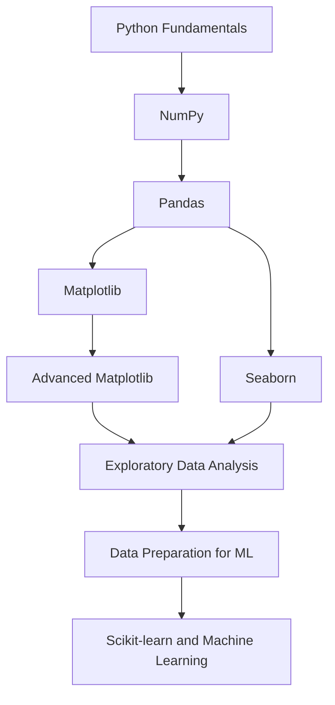
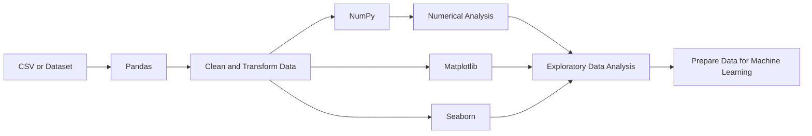

# Python Libraries for Data Analysis & AI/ML

A hands-on Python learning repository containing practical examples and notebooks for **NumPy, Pandas, Matplotlib, Advanced Matplotlib, and Seaborn**. It is organised by library and topic so you can learn a concept, run its example, and practise with data.

**Repository:** [All-about-Python-basic-OOPs-libraries-](https://github.com/rakeshtunasahu/All-about-Python-basic-OOPs-libraries-)

## Overview

This repository focuses on Python libraries commonly used in data analysis and as foundations for Artificial Intelligence and Machine Learning workflows.

- **NumPy** — numerical arrays, array operations, statistics, indexing, data cleaning, random numbers, and linear algebra.
- **Pandas** — working with tabular data, data manipulation, analysis, feature engineering, time series, and plotting.
- **Matplotlib** — creating charts such as line, bar, histogram, pie, and scatter plots.
- **Advanced Matplotlib** — more advanced plotting examples, including subplots and coloured scatter plots.
- **Seaborn** — statistical visualisation, including categorical, distribution, regression, and relational plots.

## Repository Structure

```text
All-about-Python-basic-OOPs-libraries-/
├── Advanced_matplotlib/
│   ├── coloured scatter plot examples
│   └── subplot examples
├── Matplotlib/
│   ├── Bar chart notebooks
│   ├── Basic plotting notebook
│   ├── Histogram chart examples
│   ├── Pie chart notebook
│   └── Scatter plot notebook
├── Numpy/
│   ├── NumPy basics
│   ├── Attributes and methods
│   ├── Indexing and array operations
│   ├── Data cleaning
│   ├── Linear algebra
│   ├── Random numbers
│   └── Statistical functions
├── Pandas/
│   ├── Basic functions
│   ├── Advanced Pandas
│   ├── Data analysis
│   ├── Data manipulation
│   ├── Feature engineering
│   ├── Capstone project notebook
│   ├── Pandas plotting notebook
│   └── Time series
└── Seaborn/
    ├── Categorical plots
    ├── Distribution plots
    ├── Pair and joint grid plots
    ├── Regression plots
    └── Relational plotting
```

*The structure above summarises the folders and filenames visible in the repository and screenshot; it groups some individual files by topic for readability.*

## Learning Roadmap



## 1. NumPy — Numerical Computing

NumPy provides arrays and efficient numerical operations. It is useful when working with numerical features and understanding the mathematics behind machine learning.

Topics represented in this folder include:

- NumPy basics
- Array attributes and methods
- Indexing and array operations
- Data-cleaning operations
- Statistical functions
- Random number generation
- Linear algebra

**Example use cases:** calculate statistics, reshape arrays, filter values, perform matrix operations, and generate reproducible random data.

## 2. Pandas — Data Analysis and Manipulation

Pandas is used to load, inspect, clean, transform, and analyse structured data such as CSV files.

Topics represented in this folder include:

- Basic Pandas functions
- Advanced Pandas operations
- Data analysis
- Data manipulation
- Feature engineering
- Time-series analysis
- Data visualisation with Pandas
- A capstone project notebook

**Example use cases:** inspect a dataset, select rows and columns, handle missing values, create features, analyse time-based data, and prepare a dataset for visualisation or machine learning.

## 3. Matplotlib — Data Visualisation

Matplotlib is a plotting library for building and customising charts.

Topics represented in this folder include:

- Basic plotting
- Bar charts
- Histograms
- Pie charts
- Scatter plots

**Example use cases:** compare values, inspect distributions, identify relationships between numerical variables, and communicate analytical results.

## 4. Advanced Matplotlib

The `Advanced_matplotlib` folder extends the plotting practice with examples such as:

- Coloured scatter plots
- Subplots and multi-plot layouts

Subplots are useful when comparing several charts side by side, while colour can help distinguish groups or represent another variable.

## 5. Seaborn — Statistical Visualisation

Seaborn builds on Matplotlib and makes many statistical visualisations easier to create.

Topics represented in this folder include:

- Categorical plots
- Distribution plots
- Pair and joint grid plots
- Regression plots
- Relational plots

**Example use cases:** explore feature relationships, compare categories, inspect distributions, identify possible outliers, and visualise trends.

## How the Libraries Work Together



- **Pandas** is usually the first choice for loading and manipulating tabular data.
- **NumPy** supports numerical computation and array-based operations.
- **Matplotlib** gives detailed control over plots.
- **Seaborn** provides convenient statistical visualisations built on Matplotlib.

These libraries complement one another; they do not replace the need to understand data quality, statistics, and machine-learning concepts.

## Getting Started

### Requirements

- Python 3
- Git (to clone the repository)
- Jupyter Notebook for `.ipynb` files
- VS Code or another Python editor

### Clone the repository

```bash
git clone https://github.com/rakeshtunasahu/All-about-Python-basic-OOPs-libraries-.git
cd All-about-Python-basic-OOPs-libraries-
```

### Create and activate a virtual environment (recommended)

```bash
python -m venv .venv
```

Windows:

```bash
.venv\Scripts\activate
```

macOS / Linux:

```bash
source .venv/bin/activate
```

### Install the libraries

```bash
python -m pip install numpy pandas matplotlib seaborn jupyter
```

### Open the notebooks

```bash
jupyter notebook
```

Then open the notebook you want to practise. For a standalone `.py` file, run:

```bash
python path/to/filename.py
```

Replace the example path with the actual file path. Some notebooks or scripts may expect a dataset or additional dependencies; check the relevant file before running it.

## Suggested Study Order

1. **NumPy basics** — arrays, shapes, indexing, statistics, and array operations.
2. **Pandas basics** — load, inspect, select, and clean tabular data.
3. **Pandas data manipulation and feature engineering** — transform data into useful features.
4. **Matplotlib basics** — understand the main chart types and chart customisation.
5. **Advanced Matplotlib** — practise subplots and more complex chart layouts.
6. **Seaborn** — explore distributions, categories, relationships, and regression visualisations.
7. **Capstone practice** — combine data manipulation, analysis, and visualisation on a dataset.

## Who Is This Repository For?

- Python learners practising data-related libraries
- Students building data analysis skills
- Beginners preparing for AI/ML
- Anyone who wants small, topic-wise examples to revisit while learning

## Learning Goals

- Understand the purpose of common Python data libraries.
- Practise array operations and numerical analysis.
- Manipulate and analyse tabular datasets.
- Create clear, meaningful visualisations.
- Build a foundation for exploratory data analysis and machine learning.

## Author

**Rakesh Sahu**

GitHub: [@rakeshtunasahu](https://github.com/rakeshtunasahu)

## Note

This is a learning repository. The examples are intended for practice and may be expanded over time. To keep the project easy to navigate, consider adding short explanations and expected outputs to individual notebooks as they grow.
